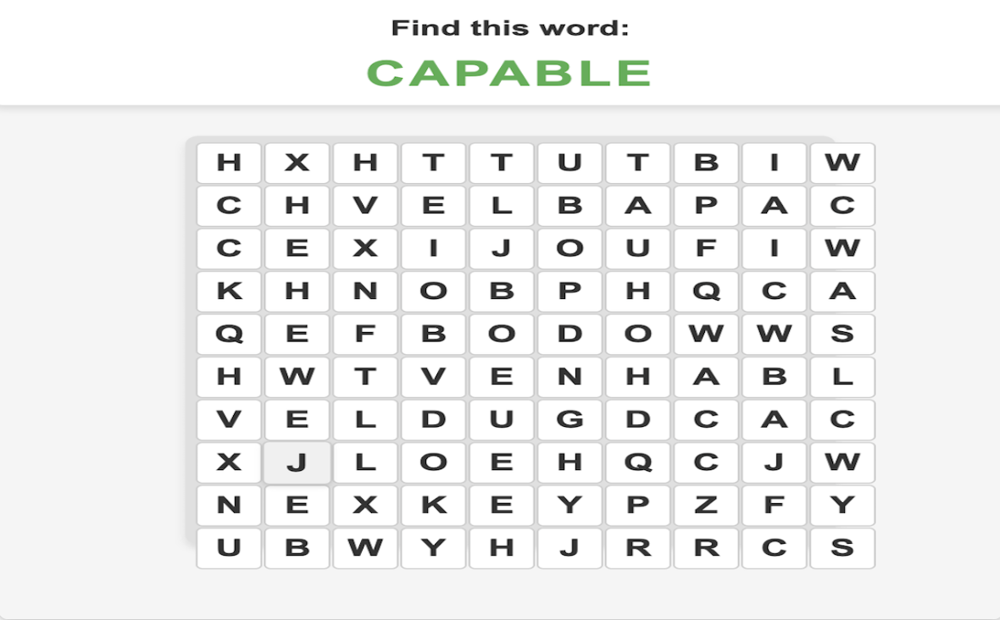

# Confidence Crew

Chrome extension offering daily word puzzles and multilingual affirmations for mental wellness.

[→ Install on Chrome Web Store](https://chromewebstore.google.com/detail/confidence-crew/docobokckdlpmmbangleoaabeoikgogh)

---

## What Is Confidence Crew

Confidence Crew is a Chrome extension that turns idle browser time into moments of self-care. Whether you're taking a mindful break during your workday or helping a child build confidence through repetition and challenge, this extension offers a relaxing, brain-boosting experience — one word and one affirmation at a time.

---

## Key Features

### Daily Word Puzzles
Relax, recharge, and challenge your brain with adaptive puzzles that increase in complexity as you improve.

### Multilingual Affirmations (Premium)
Receive uplifting, confidence-building affirmations in nine languages:
- English
- Spanish
- French
- German
- Arabic
- Gujarati
- Hindi
- Portuguese
- Chinese

### Mindful, Minimalist Design
A clean and calming interface encourages focus and emotional reset.

---

## Who It's For

- Parents and children looking to build emotional resilience through play  
- Students who want mindful breaks to reset and refocus  
- Anyone who enjoys purposeful word games and gentle encouragement

---

## Premium Unlock Includes

- Daily rotating affirmation
- Bonus word puzzles

---

## Built With

- JavaScript, HTML, CSS  
- Chrome Extensions API (Manifest v3)  
- LocalStorage for persistence  
- Planned internationalization via `_locales`

---

## Installation

Install directly from the Chrome Web Store:  
[https://chromewebstore.google.com/detail/confidence-crew/docobokckdlpmmbangleoaabeoikgogh](https://chromewebstore.google.com/detail/confidence-crew/docobokckdlpmmbangleoaabeoikgogh)

